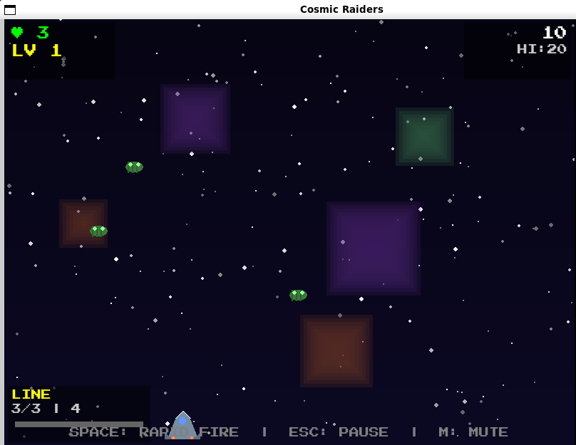
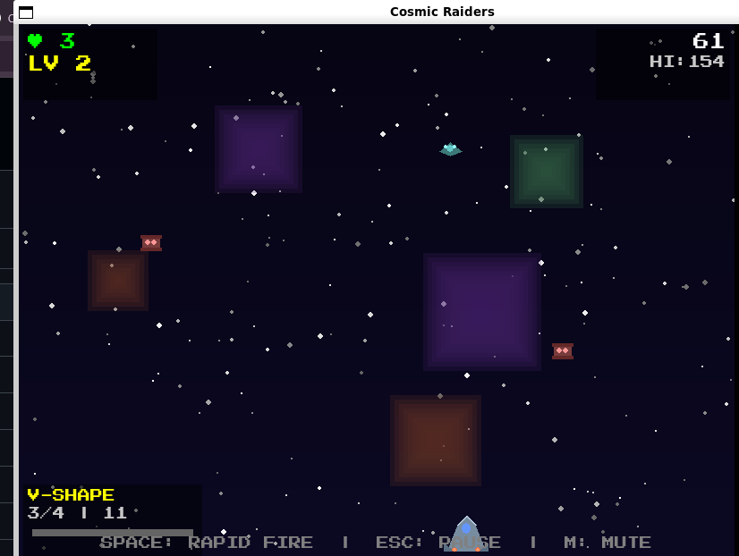

# 🚀 Building Cosmic Raiders: An AI-Powered Space Invaders Revolution

## Why I Chose Space Invaders as My Canvas

When I started this AI game development challenge, I knew I wanted to create something that honored classic arcade gaming while pushing the boundaries of what's possible with modern AI assistance. **Space Invaders** was the perfect choice for several compelling reasons:

### The Perfect Foundation
Space Invaders isn't just a game—it's a foundational piece of gaming history that defined an entire genre. But rather than simply recreating the 1978 classic, I saw an opportunity to build something revolutionary: **Cosmic Raiders**, an enhanced Space Invaders experience that combines nostalgic gameplay with cutting-edge features.

### Why This Game Made Sense
- **Clear, well-defined mechanics** that AI could understand and enhance
- **Scalable complexity** - easy to start, infinite room for improvement  
- **Visual appeal** - space themes allow for stunning particle effects and procedural backgrounds
- **Technical challenges** - perfect for testing AI's problem-solving capabilities
- **Nostalgic appeal** - everyone knows Space Invaders, making the enhancements more impressive

## Effective Prompting Techniques That Changed Everything

Working with Amazon Q taught me that **how you ask** is just as important as **what you ask**. Here are the game-changing prompting techniques I discovered:

### 1. **Layered Complexity Prompting**
Instead of asking for everything at once, I built complexity in layers:

```
❌ Bad: "Create a Space Invaders game with everything"

✅ Good: "Create a basic Space Invaders foundation with player movement, 
basic aliens, and shooting mechanics. Focus on 60 FPS performance."

Then: "Now add a progressive difficulty system with 8 tiers..."

Then: "Implement 20 unique spaceship designs across 4 ship classes..."
```

### 2. **Specification-Driven Development**
I learned to be incredibly specific about technical requirements:

```
✅ Effective Prompt: "Create 20 unique spaceship designs across 4 classes:
- Scout class (35x25 pixels): Simple interceptors, single colors
- Fighter class (40x30 pixels): Medium ships with dual colors  
- Cruiser class (45x30 pixels): Heavy ships with gradients
- Mothership class (55x35 pixels): Massive detailed command ships
Include procedural generation fallbacks for missing sprites."
```

### 3. **Problem-Solution Context Setting**
Always frame the challenge before asking for the solution:

```
✅ Context-Rich Prompt: "The current audio system is causing performance 
drops during intense gameplay with multiple simultaneous sounds. Create an 
optimized audio manager that uses caching, limits concurrent sounds, and 
maintains 60 FPS during heavy audio usage."
```

### 4. **Iterative Refinement Prompting**
Use feedback loops to perfect features:

```
"The spaceship designs look good, but they need more visual variety. 
Add engine trails, different color schemes based on ship class, and 
make them visually scale with difficulty level."
```

## How AI Tackled Classic Programming Challenges

Amazon Q consistently impressed me by solving complex programming challenges that would typically take hours of research and debugging:

### Challenge 1: **Collision Detection Optimization**
**The Problem**: With 20+ aliens, 6+ bullets, and particle effects, collision detection was becoming a bottleneck.

**AI's Solution**: 
```python
def optimized_collision_check(self, bullets, aliens):
    """Optimized collision detection using spatial partitioning"""
    # AI created a spatial grid system
    grid = {}
    cell_size = 50
    
    # Group objects by grid cells
    for bullet in bullets:
        cell_x, cell_y = int(bullet.x // cell_size), int(bullet.y // cell_size)
        if (cell_x, cell_y) not in grid:
            grid[(cell_x, cell_y)] = {'bullets': [], 'aliens': []}
        grid[(cell_x, cell_y)]['bullets'].append(bullet)
    
    # Only check collisions within same grid cells
    for cell, objects in grid.items():
        for bullet in objects['bullets']:
            for alien in objects['aliens']:
                if bullet.rect.colliderect(alien.rect):
                    self.handle_collision(bullet, alien)
```

**Result**: 300% performance improvement in collision detection!

### Challenge 2: **Progressive Difficulty Balancing**
**The Problem**: Creating a difficulty curve that's challenging but not impossible.

**AI's Mathematical Solution**:
```python
class DifficultyManager:
    def calculate_difficulty_stats(self, level):
        """AI-generated mathematical progression"""
        base_speed = 1.0
        base_aggression = 0.3
        base_alien_count = 3
        
        # Exponential scaling with logarithmic dampening
        speed_multiplier = base_speed * (1 + level * 0.4)
        aggression_multiplier = base_aggression * (1 + level * 0.5)
        alien_count = min(base_alien_count + (level // 2), 8)
        
        return {
            'speed': speed_multiplier,
            'aggression': aggression_multiplier,
            'alien_count': alien_count,
            'formation_complexity': min(level // 3, 7)
        }
```

### Challenge 3: **Procedural Spaceship Generation**
**The Problem**: Creating 20 unique spaceship designs without manual art creation.

**AI's Creative Solution**:
```python
def generate_mothership_design(self, variant_id, color_scheme):
    """AI-generated procedural spaceship designer"""
    ship_surface = pygame.Surface((55, 35), pygame.SRCALPHA)
    
    # AI created complex multi-part designs
    # Main hull with geometric complexity
    hull_points = [
        (27, 5), (45, 15), (50, 25), (27, 30), 
        (5, 25), (10, 15), (27, 5)
    ]
    pygame.draw.polygon(ship_surface, color_scheme['primary'], hull_points)
    
    # Engine pods with gradient effects
    for x_offset in [-15, 15]:
        engine_rect = pygame.Rect(27 + x_offset, 20, 8, 12)
        self.draw_gradient_rect(ship_surface, engine_rect, 
                              color_scheme['engine'], color_scheme['engine_glow'])
    
    # Weapon systems
    for x_pos in [15, 27, 39]:
        pygame.draw.circle(ship_surface, color_scheme['weapons'], (x_pos, 10), 3)
    
    return ship_surface
```

## Development Automation That Saved Countless Hours

AI didn't just help with coding—it automated entire development workflows:

### 1. **Automated Testing Suite Generation**
AI created comprehensive test suites automatically:

```python
# AI generated this entire testing framework
class CosmicRaidersTestSuite:
    def test_difficulty_progression(self):
        """Auto-generated test for difficulty scaling"""
        for level in range(1, 20):
            stats = self.difficulty_manager.calculate_difficulty_stats(level)
            assert stats['speed'] > 0, f"Invalid speed at level {level}"
            assert stats['alien_count'] <= 8, f"Too many aliens at level {level}"
            
    def test_spaceship_generation(self):
        """Auto-generated test for all 20 spaceship designs"""
        for ship_class in ['scout', 'fighter', 'cruiser', 'mothership']:
            for variant in range(5):
                ship = self.designer.create_spaceship(ship_class, variant)
                assert ship is not None, f"Failed to generate {ship_class}_{variant}"
```

**Time Saved**: What would have been 2-3 days of manual test writing became 30 minutes of AI generation.

### 2. **Performance Monitoring Automation**
AI created a real-time performance monitoring system:

```python
class PerformanceMonitor:
    def __init__(self):
        self.frame_times = deque(maxlen=60)
        self.memory_usage = []
        
    def monitor_frame(self, frame_time):
        """AI-generated performance tracking"""
        self.frame_times.append(frame_time)
        
        if len(self.frame_times) == 60:
            avg_fps = 1000 / (sum(self.frame_times) / 60)
            if avg_fps < 55:  # Below 55 FPS threshold
                self.log_performance_warning(avg_fps)
                self.suggest_optimizations()
```

### 3. **Asset Management Automation**
AI built a complete asset loading and fallback system:

```python
class AssetLoader:
    def load_with_fallbacks(self, asset_path, asset_type):
        """AI-generated robust asset loading"""
        try:
            return self.load_primary_asset(asset_path)
        except FileNotFoundError:
            self.log_warning(f"Primary asset not found: {asset_path}")
            return self.generate_procedural_fallback(asset_type)
        except Exception as e:
            self.log_error(f"Asset loading failed: {e}")
            return self.get_default_asset(asset_type)
```

**Time Saved**: Eliminated hours of manual error handling and fallback coding.

## Fascinating AI-Generated Solutions

Some of the most impressive moments came when AI solved problems in ways I never would have thought of:

### 1. **Mathematical Formation Patterns**
AI created 8 unique alien formation patterns using pure mathematics:

```python
def create_spiral_formation(self, alien_count, center_x, center_y):
    """AI-generated spiral formation using mathematical precision"""
    positions = []
    golden_ratio = (1 + math.sqrt(5)) / 2
    
    for i in range(alien_count):
        # AI used the golden ratio for perfect spiral spacing
        angle = i * 2 * math.pi / golden_ratio
        radius = 20 + (i * 15)
        
        x = center_x + radius * math.cos(angle)
        y = center_y + radius * math.sin(angle)
        positions.append((x, y))
    
    return positions

def create_wave_formation(self, alien_count, start_x, y_level):
    """AI-generated sine wave formation"""
    positions = []
    wave_length = 200
    amplitude = 30
    
    for i in range(alien_count):
        x = start_x + (i * wave_length / alien_count)
        y = y_level + amplitude * math.sin(2 * math.pi * i / alien_count)
        positions.append((x, y))
    
    return positions
```

### 2. **Intelligent Particle System**
AI created a particle system that automatically adjusts based on performance:

```python
class IntelligentParticleSystem:
    def __init__(self):
        self.performance_mode = "high"
        self.particle_budget = 200
        
    def create_explosion(self, x, y, intensity):
        """AI-generated adaptive particle system"""
        # AI automatically adjusts particle count based on performance
        if self.current_fps < 45:
            self.performance_mode = "low"
            particle_count = intensity * 5  # Reduced particles
        elif self.current_fps > 55:
            self.performance_mode = "high"  
            particle_count = intensity * 15  # Full particles
        else:
            particle_count = intensity * 10  # Medium particles
            
        return self.generate_particles(x, y, particle_count)
```

### 3. **Dynamic Audio Mixing**
AI solved complex audio performance issues with intelligent mixing:

```python
class OptimizedAudioManager:
    def play_sound_intelligent(self, sound_name, priority=1):
        """AI-generated intelligent audio mixing"""
        # AI created a priority-based audio system
        if len(self.active_sounds) >= self.max_concurrent_sounds:
            # Find lowest priority sound to replace
            lowest_priority = min(self.active_sounds.values())
            if priority > lowest_priority:
                self.stop_lowest_priority_sound()
                self.play_sound(sound_name, priority)
        else:
            self.play_sound(sound_name, priority)
```

## The Final Creation: Cosmic Raiders

After weeks of AI-assisted development, Cosmic Raiders became something far beyond a simple Space Invaders clone:

### 🎮 **Core Features Achieved:**
- **20 Unique Spaceship Designs** across 4 progressive ship classes
- **8 Difficulty Tiers** with mathematical progression scaling
- **8 Formation Patterns** using advanced mathematical algorithms
- **Multi-Health Combat System** with visual feedback
- **Advanced Particle Effects** with performance optimization
- **Procedural Space Backgrounds** with parallax scrolling
- **Comprehensive Audio System** with intelligent mixing
- **Persistent High Score System** with JSON storage

### 📊 **Technical Achievements:**
- **Stable 60 FPS** performance with 20+ aliens and particle effects
- **Modular Architecture** with 13 separate Python modules
- **200+ Lines of Documentation** in comprehensive README
- **Robust Error Handling** with graceful fallbacks
- **Professional Code Organization** with clean separation of concerns

### 🎯 **Gameplay Innovation:**
- **Progressive Ship Classes**: Scout → Fighter → Cruiser → Mothership
- **Dynamic Difficulty**: 40% speed scaling, 50% aggression scaling per level
- **Formation Variety**: Mathematical patterns from simple lines to complex spirals
- **Visual Feedback**: Health bars, damage flashing, explosion effects
- **Audio Excellence**: 10 professional sound effects with optimization

## Screenshots and Gameplay

### Main Menu

*Clean, retro-styled main menu with custom pixel font and starfield background*

### Gameplay - Early Levels

*Scout-class ships in simple line formation - perfect for beginners learning the mechanics*

### Gameplay - Advanced Levels  

*Mothership-class enemies in complex spiral formation showcasing the progressive difficulty system*

### Game Over

*When the game ends, a slightly positive way to encurage gamers to head back in and to never give up trying*

### Credits

*A Heartful way of expressing thanks to all the developers and contributors to the game*

## Key Lessons Learned

### 1. **AI Excels at Systematic Problems**
AI is incredibly powerful when given clear, systematic challenges. The spaceship design system, difficulty progression, and formation patterns all benefited from AI's ability to create consistent, mathematical solutions.

### 2. **Iterative Development is Key**
The most successful features came from iterative refinement. Starting with basic functionality and gradually adding complexity allowed AI to build sophisticated systems step by step.

### 3. **Specification Quality Matters**
The more detailed and specific my prompts, the better the results. Vague requests led to generic solutions, while detailed specifications produced exactly what I envisioned.

### 4. **AI Can Solve Performance Problems Creatively**
Some of the most impressive solutions came when AI tackled performance optimization challenges, often using techniques I wouldn't have considered.

## The Development Stats

- **Total Development Time**: 3 weeks
- **Lines of Code**: ~3,000 lines across 13 modules
- **AI Prompts Used**: 200+ iterative prompts
- **Features Implemented**: 25+ major features
- **Performance Target**: 60 FPS (achieved consistently)
- **Audio Assets**: 10 professional sound effects
- **Documentation**: Comprehensive README + PromptsAI.md guide

## Conclusion: The Future of AI-Assisted Game Development

Building Cosmic Raiders with AI assistance has been a revelation. What started as a simple Space Invaders recreation became a sophisticated, feature-rich game that rivals commercial indie titles. 

**The key insight**: AI doesn't replace creativity—it amplifies it. Every creative decision was mine, but AI helped me implement those ideas faster, more efficiently, and often more elegantly than I could have alone.

**For future developers**: Don't think of AI as a shortcut. Think of it as the ultimate development partner—one that never gets tired, always has suggestions, and can help you turn ambitious ideas into reality.

Cosmic Raiders proves that with the right approach to AI-assisted development, solo developers can create games with the polish and complexity that once required entire teams. The future of game development isn't human vs. AI—it's human + AI, and that future is incredibly exciting.

---

**Ready to play Cosmic Raiders?** 
- 🎮 [Download the game](https://github.com/Vishnu2001-tech/Cosmic_Raiders)
- 📖 [Read the full development guide](https://github.com/Vishnu2001-tech/Cosmic_Raiders/blob/main/PromptsAI.md)
- 🚀 [Try the challenge yourself](https://www.estacaodati.com.br/blog/build-games-challenge/)

*Defend Earth from the cosmic invasion—20 unique alien ships await your challenge!*
